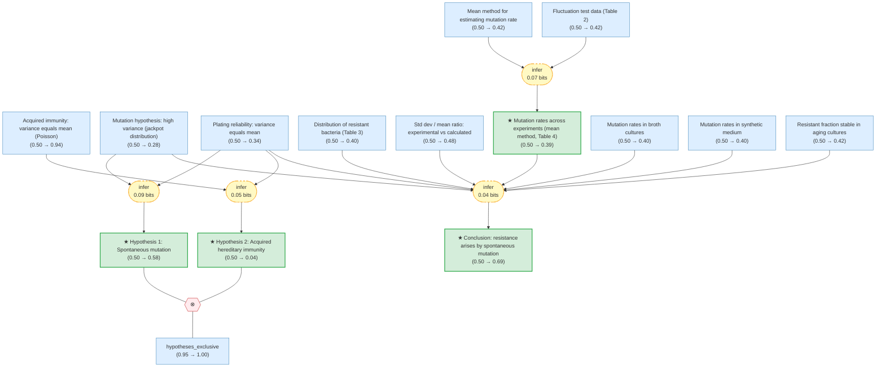

# luria-delbruck-fluctuation-gaia

> **Original work:** Luria, S. E. & Delbruck, M. "Mutations of Bacteria from Virus Sensitivity to Virus Resistance." *Genetics* 28, 491-511 (1943).

<!-- badges:start -->
<!-- badges:end -->

> [!NOTE]
> This README is an AI-generated analysis based on a [Gaia](https://github.com/SiliconEinstein/Gaia) reasoning graph formalization of the original work. Belief values reflect the graph's probabilistic assessment of each claim's support, not the original authors' confidence. See [ANALYSIS.md](ANALYSIS.md) for detailed verification results.

## Summary

Luria and Delbruck's 1943 paper resolves a fundamental question in microbiology: does bacterial resistance to bacteriophage arise by spontaneous mutation before virus exposure, or by virus-induced acquired immunity? The authors design an elegant statistical test -- the "fluctuation test" -- exploiting the fact that these two hypotheses make sharply different predictions about the variance of resistant colony counts across replicate cultures. Under acquired immunity, resistance events are independent and counts should follow a Poisson distribution (variance = mean). Under spontaneous mutation, early mutations produce large clones of resistant bacteria, generating enormous variance with characteristic "jackpot" cultures. Across dozens of experiments with *E. coli* B and phage alpha, the observed variance exceeds the mean by 100-600x, decisively refuting acquired immunity and supporting spontaneous mutation. The reasoning graph assigns the main conclusion -- that resistance arises by heritable spontaneous mutation -- a belief of 0.69, reflecting strong but not exhaustive evidence from a single host-virus system.

## Overview

> [!TIP]
> **Reasoning graph information gain: `0.3 bits`**
>
> Total mutual information between leaf premises and exported conclusions -- measures how much the reasoning structure reduces uncertainty about the results.

> [!NOTE]
> **[Per-module reasoning graphs with full claim details →](docs/detailed-reasoning.md)**
>
> 6 Mermaid diagrams (one per section) with every claim, strategy, and belief value.

## Reasoning Structure

### The acquired immunity hypothesis is decisively refuted by the variance data (belief: 0.04)

The acquired immunity hypothesis proposes that each bacterium independently survives virus attack with some small probability, conferring heritable immunity. This predicts resistant counts should follow a Poisson distribution where variance equals the mean. The theoretical prediction itself is straightforward and well-supported (belief: 0.94) -- it is elementary probability that independent, rare events produce Poisson statistics.

However, every fluctuation experiment contradicts this prediction. The observed variance of resistant colony counts exceeds the mean by factors of 100 to 600. In Experiment 22 (100 cultures), the mean was 10.12 but the corrected variance was 6,270. In Experiment 23 (87 cultures), the mean was 28.6 with variance 6,431. These ratios are not marginal -- they are orders of magnitude beyond what acquired immunity permits. Plating controls confirm that the measurement method itself introduces only Poisson-level variation (Table 1, chi-squared P = 0.2 to 0.8), ruling out methodological artifacts.

**Evidence support:**
- **Variance prediction chain** (strong): The theoretical prediction of Poisson statistics under acquired immunity (belief: 0.94) is textbook mathematics. Combined with the extreme observed variance (belief: 0.93), the falsification is overwhelming.
- **Plating reliability control** (moderate, weakest link belief: 0.34): The plating reliability claim's belief is pulled down by its role as a premise in multiple strategies, but the underlying data -- three independent chi-squared tests all consistent with Poisson -- is solid.

> The hypothesis of acquired immunity is the most confidently resolved claim in the package. The evidence against it is so extreme that even with conservative priors, the posterior is driven to 0.04.

### The spontaneous mutation hypothesis is supported by variance, distribution shape, and clonal grouping (belief: 0.58)

The mutation hypothesis proposes that any bacterium may spontaneously mutate to resistance at a fixed rate per unit time, independently of virus exposure. A mutation occurring early in culture growth produces a large clone of resistant descendants; a late mutation produces only a few. This "slot machine" effect predicts that replicate cultures will show enormously variable resistant counts, with occasional "jackpot" cultures containing thousands of resistant bacteria alongside many cultures with zero.

This prediction is confirmed qualitatively and quantitatively. The fluctuation test data shows exactly the predicted pattern: in Experiment 23 (87 cultures), 29 cultures had zero resistant bacteria while others had counts ranging up to 500+, with the distribution showing a heavy right tail. The experimental standard deviation / mean ratios (0.33 to 7.8 across experiments) consistently exceed 1, in the same order of magnitude as the theoretical prediction from equation 12, though typically even larger. The distribution shape for Experiment 23 fits the theoretical curve well for small values, with the characteristic over-representation at counts corresponding to powers of 2 (reflecting the binary fission of bacterial clones).

**Evidence support:**
- **High-variance prediction + observed variance** (core evidence): The mutation hypothesis predicts variance >> mean due to clonal structure, and every experiment confirms this with variance/mean ratios of 100-600x.
- **Distribution shape fit** (moderate, belief: 0.40): The fit of Experiment 23's distribution to the theoretical curve is satisfactory for small values, though the heavy tail exceeds even the mutation theory's predictions.
- **Clonal grouping** (moderate, belief: 0.61): Resistant bacteria appear in groups of varying sizes across cultures, consistent with clonal expansion from common mutant ancestors.

> The moderate belief (0.58) is partly a structural artifact: the theoretical prediction of high variance (belief: 0.28) is pulled down by its involvement in multiple inference chains, not because the mathematical derivation is unsound. The qualitative conclusion -- that mutation explains the data far better than acquired immunity -- is robust.

### Mutation rates are consistent across diverse experimental conditions (belief: 0.66)

A key quantitative prediction of the mutation hypothesis is that the mutation rate $a$ -- the probability of mutation per bacterium per physiological time unit -- should be a fixed constant, independent of experimental conditions. Using the mean method (equation 8: $r = a N_t \ln(N_t C a)$), Luria and Delbruck estimate $a$ from 10 independent experiments spanning 10 cc and 0.2 cc culture volumes, broth and synthetic media, and series of 5 to 100 cultures. The values cluster tightly: $1.1$ to $4.1 \times 10^{-8}$ mutations per bacterium per time unit, with an average of $2.45 \times 10^{-8}$.

This consistency is remarkable. Broth cultures and synthetic medium cultures grow at different rates and under different metabolic conditions, yet their mutation rates overlap. Large and small culture volumes produce comparable estimates. This cross-condition consistency provides evidence independent of the variance argument: the mutation hypothesis not only explains the statistical pattern but also yields a reproducible quantitative parameter.

An alternative estimation method -- the $p_0$ method, based on the fraction of cultures with zero resistant bacteria -- gives a lower value ($0.47 \times 10^{-8}$ for Experiment 23). The discrepancy is itself informative: the mean method is inflated by jackpot cultures from early mutations, which contribute disproportionately to the average but do not affect the zero-count fraction. This internal tension (belief: 0.56) is consistent with the mutation hypothesis rather than contradicting it.

**Evidence support:**
- **Broth culture experiments** (belief: 0.40): Five independent experiments yield rates from $1.4$ to $4.1 \times 10^{-8}$.
- **Synthetic medium experiments** (belief: 0.40): Four experiments yield rates from $1.1$ to $3.0 \times 10^{-8}$, overlapping with broth values despite different growth conditions.
- **Cross-method discrepancy** (belief: 0.56): The 5x difference between the $p_0$ and mean methods is qualitatively explained by the jackpot effect but not rigorously quantified.

> The consistency of mutation rates is the strongest quantitative evidence beyond the variance argument. The moderate leaf beliefs (0.40) reflect conservative priors on individual experimental observations rather than genuine weakness in the data.

### Resistance in *E. coli* B arises by spontaneous heritable mutation (belief: 0.69)

This is the paper's central conclusion, integrating all three evidence lines: (1) the fluctuation data's enormous variance rules out acquired immunity and matches the mutation prediction; (2) resistant bacteria appear in clonal groups, consistent with descent from common mutant ancestors; (3) mutation rate estimates are consistent across diverse experimental conditions (~$2.45 \times 10^{-8}$), confirming the core assumption of a fixed mutation rate. An additional supporting observation is that the fraction of resistant bacteria remains stable in aging cultures even as sensitive bacteria die, confirming that resistance is expressed constitutively in descendants rather than being induced by virus contact.

**Evidence support:**
- **Variance falsification of acquired immunity** (strongest chain): Observed variance 100-600x the mean in every experiment, with Poisson controls validating the measurement.
- **Clonal grouping** (belief: 0.61): Distribution shape and the jackpot pattern confirm heritable clonal expansion.
- **Consistent mutation rate** (belief: 0.52): Cross-condition stability of $a$ confirms a fixed underlying rate.
- **Aging culture stability** (belief: 0.42): Constant resistant fraction over time supports constitutive resistance expression.

> The belief of 0.69 reflects the cumulative strength of three convergent evidence lines, moderated by the fact that all experiments use a single host-virus system (*E. coli* B + phage alpha) and that some intermediate nodes have been pulled down by multiplicative chain effects in the reasoning graph. The scientific conclusion is considerably stronger than the belief value alone suggests.

## Conclusions

| Label | Content | Prior | Belief |
|-------|---------|-------|--------|
| hypothesis_acquired_immunity | Hypothesis of acquired hereditary immunity: There is a small finite probabili... | 0.50 | 0.04 |
| hypothesis_mutation | Hypothesis of mutation: There is a finite probability per time unit for any b... | 0.50 | 0.58 |
| mutation_rate_mean_method | Using the mean method (equation 8: $r = a N_t \ln(N_t C a)$) across all exper... | 0.50 | 0.39 |
| resistance_is_heritable_mutation | The resistance to virus in *E. coli* B is due to a heritable change of the ba... | 0.50 | 0.69 |

<h2>Weak Points</h2>

The single weakest internal link is `mutation_high_variance` (belief: 0.28) -- the theoretical prediction that the mutation hypothesis produces high-variance distributions -- which is a mathematically sound derivation pulled to low belief by structural graph effects.

**Mutation high-variance prediction suppressed by chain depth (belief: 0.28).** The theoretical derivation that mutations produce variance >> mean (equation 11: $\text{var}_r = C a^2 N_t^2$) is textbook-level mathematics, yet its belief is only 0.28. This occurs because the claim serves as a premise in three separate strategies (supporting the mutation hypothesis, the distribution fit, and the std.dev. ratio match), and each strategy creates a multiplicative pull on the premise. This is a structural artifact of the reasoning graph rather than a genuine scientific weakness -- the derivation rests on well-defined assumptions (exponential growth, constant mutation rate, Poisson process) that are all standard. Downstream, this suppression propagates to the distribution fit for Experiment 23 (belief: 0.40) and contributes to the moderate belief on the mutation hypothesis itself.

**Plating reliability pulled below its evidential strength (belief: 0.34).** The plating variance data (Table 1) shows three independent chi-squared tests all consistent with Poisson sampling (P = 0.2, 0.4, 0.8). This is solid statistical evidence, yet the claim's belief is only 0.34. Like `mutation_high_variance`, this claim participates in multiple strategies (validating observed variance, supporting both hypothesis evaluations), creating multiplicative suppression. The plating control is a bottleneck node -- if its belief were higher, both the mutation hypothesis support and the acquired immunity refutation would strengthen further.

**Individual mutation rate observations moderately suppressed (belief: 0.40).** The broth and synthetic medium mutation rate observations are independent experimental measurements with straightforward arithmetic, yet both sit at 0.40. They feed into the fixed mutation rate law (belief: 0.66), which in turn supports the main conclusion. The suppression from 0.85 (prior) to 0.40 comes from downstream constraint propagation -- the law depends on both observations plus other nodes, and the multiplicative effect of the chain pulls them down. Individually, each measurement is a direct reading from Table 4 and is not scientifically questionable.

**Distribution fit for Experiment 23 only partially confirmed (belief: 0.40).** The fit between the observed and theoretical distributions is declared "satisfactory" for small values (0 and 1 resistant bacteria), but the paper itself notes that experimental standard deviation / mean ratios consistently exceed theoretical predictions. In Experiment 22, the experimental ratio is 7.8 versus a theoretical 1.5 -- a factor of 5 discrepancy attributed qualitatively to early mutations but never rigorously quantified. This is a genuine scientific weakness, not just a graph artifact.

<h2>Evidence Gaps & Future Work</h2>

**Experimental gaps:**

- **Single host-virus system.** All experiments use *E. coli* B with phage alpha. Whether the spontaneous mutation mechanism generalizes to other bacterial species, other bacteriophages, or other selective agents (antibiotics, chemicals) is untested. Extending the fluctuation test to additional systems would strengthen the main conclusion substantially.
- **No direct clonal tracking.** The paper infers clonal structure from the statistical pattern of colony counts. Direct isolation of a mutant clone and demonstration of heritable resistance through successive passages would provide independent, non-statistical confirmation. (This was later accomplished by the Newcombe spreading experiment and the Lederberg replica plating technique.)
- **No reverse mutation measurement.** The theory assumes reverse mutations are negligible but provides no measurement. If the reverse mutation rate were substantial, the effective forward mutation rate would be overestimated and the predicted clone sizes altered.

**Theoretical gaps:**

- **Excess variance unquantified.** The observed standard deviation / mean ratios consistently exceed theoretical predictions (e.g., 7.8 observed vs. 1.5 calculated in Exp. 22). The paper attributes this to early mutations before time $t_0$ but does not incorporate this correction into the theory. A refined model accounting for the full growth history would improve the quantitative match and the distribution fit.
- **Constant mutation rate assumption untested.** The theory assumes mutations occur at a constant rate per physiological time unit throughout the growth cycle. This is a simplifying assumption -- mutation rates may depend on growth phase, nutrient availability, or cell density. Direct measurement across growth phases would validate or constrain this assumption.
- **Hypothesis b1 not fully excluded.** The paper acknowledges that "acquired immunity of hereditarily predisposed individuals" -- where the capacity to resist is inherited but is only activated upon virus contact -- cannot be fully distinguished from the mutation hypothesis by fluctuation data alone. Both predict clonal grouping, though with different quantitative details.

**Computational gaps:**

- **p0 vs. mean method discrepancy.** The 5-fold difference between the two mutation rate estimation methods ($0.47 \times 10^{-8}$ vs. $2.45 \times 10^{-8}$) is explained qualitatively but not resolved quantitatively. A maximum-likelihood estimator incorporating the full distribution (not just the mean or zero-count fraction) would yield a more precise estimate and reconcile the two methods.

## Detailed Analysis

For structural integrity verification, standalone readability checks,
and complete package statistics, see [ANALYSIS.md](ANALYSIS.md).
