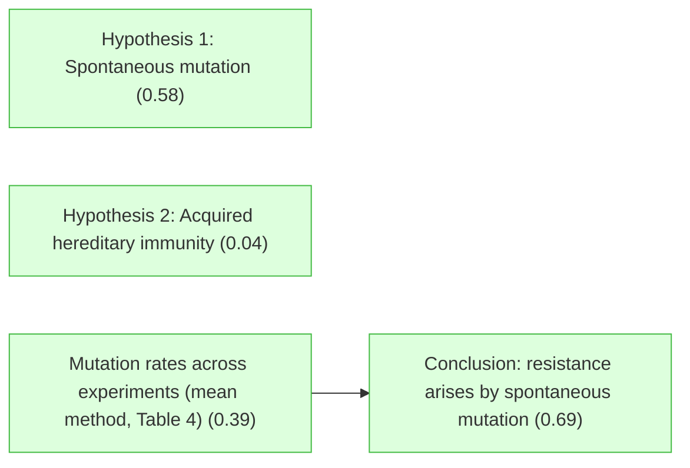
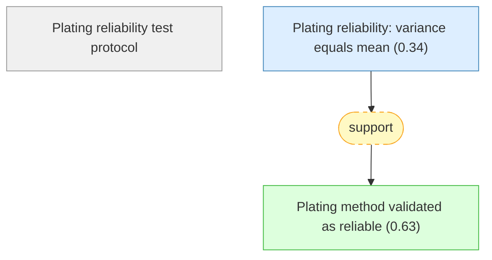
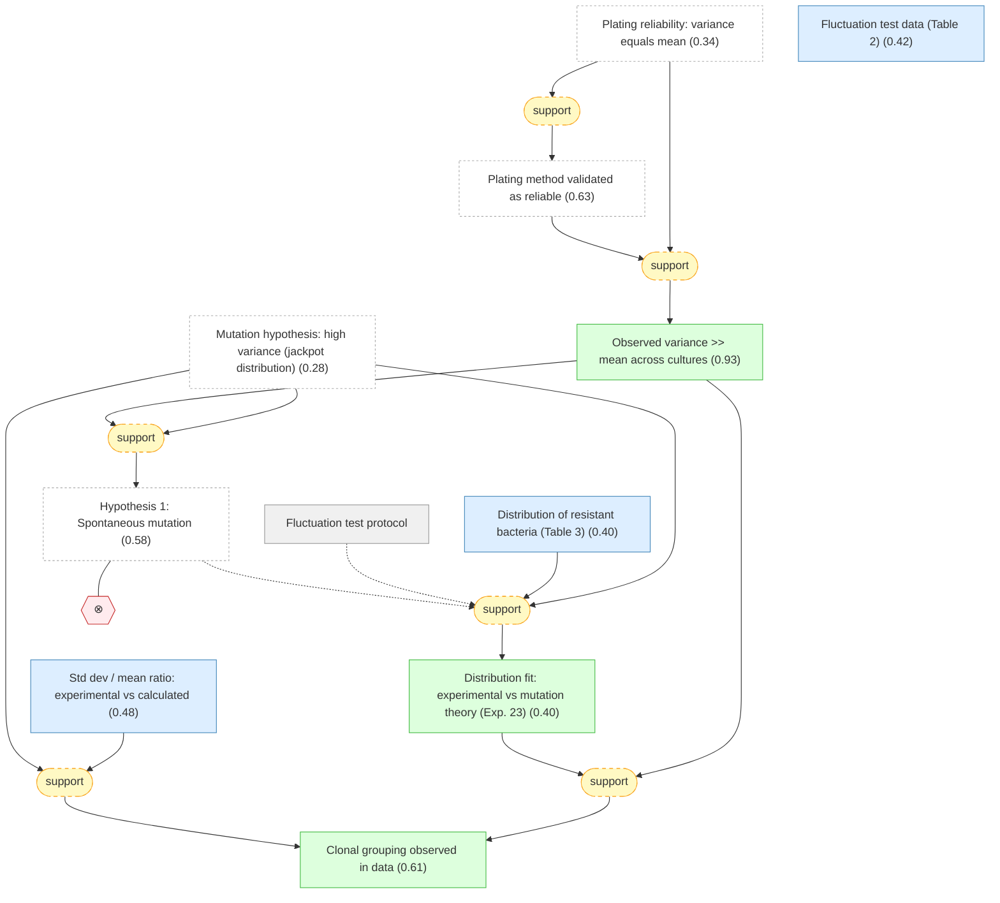
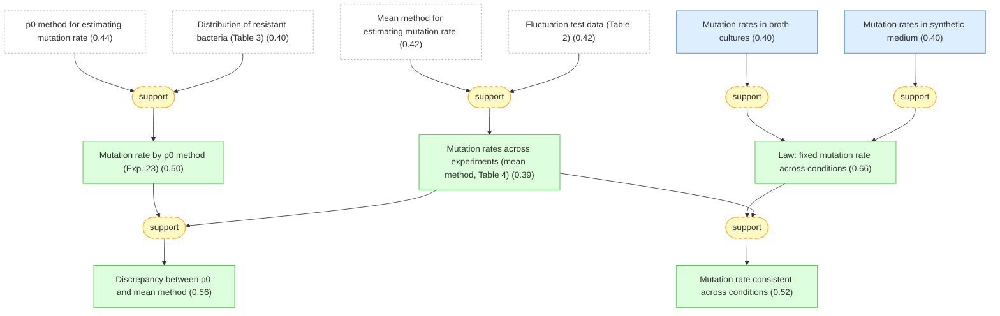
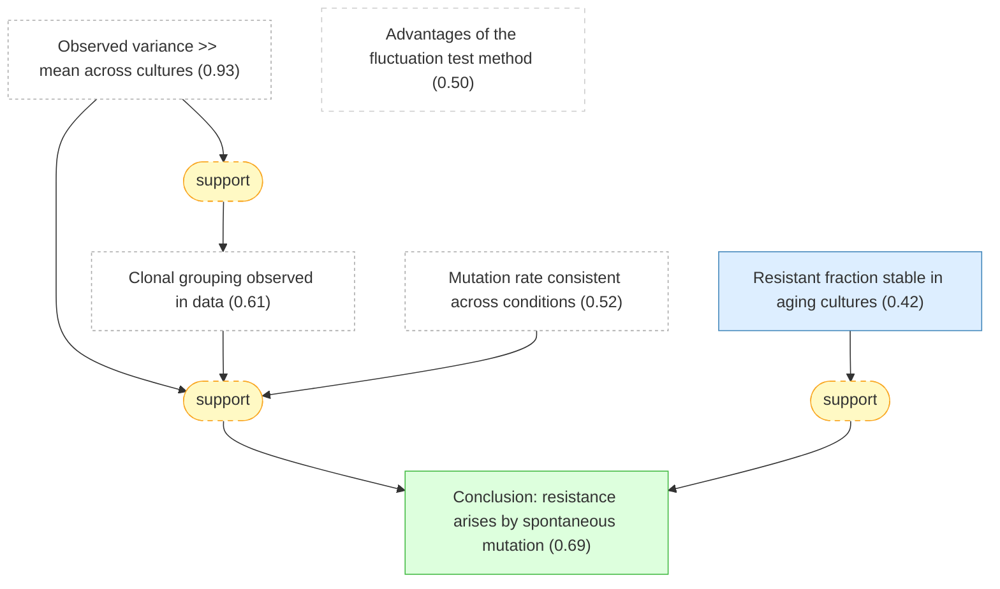

# luria-delbruck-fluctuation-gaia

Formalization of Luria & Delbruck (1943) — Mutations of Bacteria from Virus Sensitivity to Virus Resistance

## Overview

## Introduction and Motivation — Competing hypotheses for the origin of virus-resistant bacteria.

#### Experimental system: bacterial virus resistance

📋 `experimental_system`

> A pure bacterial culture of *Escherichia coli* B is attacked by bacteriophage (bacterial virus) alpha. Sensitive cells are lysed (destroyed) within hours. After further incubation the culture becomes turbid again due to growth of a resistant variant that does not adsorb the virus. This variant retains resistance through many generations in the absence of virus.

#### Properties of resistant variants

📋 `resistance_properties`

> The resistant variant's resistance is generally rather specific to the inciting virus strain. The variant may differ from the original strain in morphological or metabolic characteristics, or in serological type or colony type, but most often no correlated changes are apparent besides virus resistance.

#### Central question

❓ `central_question`

> What is the origin of virus-resistant bacterial variants: do they arise by spontaneous heritable mutation prior to virus exposure, or by virus-induced acquired hereditary immunity?

#### Hypothesis 1: Spontaneous mutation ★

📌 `hypothesis_mutation`   |   Belief: **0.58**

> Hypothesis of mutation: There is a finite probability per time unit for any bacterium to mutate from 'sensitive' to 'resistant.' Every offspring of such a mutant will be resistant, unless reverse mutation occurs. The term 'resistant' means the bacterium will not be killed if exposed to virus, and the possibility of interaction with virus is left open. Mutations occur spontaneously, prior to and independently of virus exposure.

🔗 **support**([Mutation hypothesis: high variance (jackpot distribution)](#mutation_high_variance), [Observed variance >> mean across cultures](#observed_variance_much_greater_than_mean))

Reasoning

@mutation_high_variance predicts variance >> mean due to the clonal structure of resistant bacteria (early mutations → large clones → jackpots). @observed_variance_much_greater_than_mean confirms this prediction: variance/mean ratios of 100-600x in every experiment. The observation matches the mutation prediction qualitatively and quantitatively.

#### Hypothesis 2: Acquired hereditary immunity ★

📌 `hypothesis_acquired_immunity`   |   Belief: **0.04**

> Hypothesis of acquired hereditary immunity: There is a small finite probability for any bacterium to survive an attack by the virus. Survival confers immunity not only to the individual but also to its offspring. The probability of survival in the first instance does not run in clones; if we find that a bacterium survives an attack, we cannot from this information alone infer that close relatives are likely to survive the attack.

🔗 **support**([Acquired immunity: variance equals mean (Poisson)](#immunity_variance_equals_mean), [Observed variance >> mean across cultures](#observed_variance_much_greater_than_mean))

Reasoning

@immunity_variance_equals_mean predicts Poisson distribution (variance = mean). @observed_variance_much_greater_than_mean shows variance is 100-600x the mean in every experiment. The acquired immunity prediction is falsified by orders of magnitude. This observation is fatal to the hypothesis.

#### Mutation hypothesis predicts clonal variance

📌 `mutation_predicts_clonal_grouping`   |   Belief: **0.50**

> On the mutation hypothesis, resistant bacteria in a culture arise from mutations that may occur at any time prior to virus exposure. The culture therefore will contain 'clones of resistant bacteria' of various sizes: early mutations produce large clones, late mutations produce small clones. Consequently, the number of resistant bacteria in replicate cultures will show high variance — clonal grouping rather than random sampling.

#### Immunity hypothesis predicts Poisson distribution

📌 `immunity_predicts_poisson`   |   Belief: **0.50**

> On the hypothesis of acquired immunity, resistant bacteria represent a random sample of the population that survived virus attack. Each bacterium has an independent, equal probability of surviving. The number of resistant bacteria in replicate cultures should therefore follow a Poisson distribution, with variance equal to the mean.

#### hypotheses_exclusive

📌 `hypotheses_exclusive`   |   Prior: 0.95   |   Belief: **1.00**

> not_both_true(A, B)

## Theory — Mathematical predictions under each hypothesis (treated as established derivations).

#### Exponential growth model

📋 `exponential_growth_model`

> Bacteria grow exponentially. Choosing the average division time divided by ln 2 as the time unit, the number of bacteria $N_t$ at time $t$ follows $dN_t/dt = N_t$, hence $N_t = N_0 e^t$, where $N_0$ is the initial number.

#### Mutation rate definition

📋 `mutation_rate_definition`

> The mutation rate $a$ is defined as the chance of mutation per bacterium per time unit (where time is measured in units of the average division time divided by ln 2). During a time element $dt$, the chance of mutation for each bacterium is $a \, dt$.

#### Clone size-age relation

📋 `clone_size_age_relation`

> Resistant bacteria are grouped into clones. The 'age' of a clone is the time since its parent mutation occurred; the 'size' is the number of bacteria in the clone at time of observation. Assuming resistant bacteria grow at the same rate as sensitive bacteria (equation $N_t = N_0 e^t$), clone size increases exponentially with age.

#### Acquired immunity: variance equals mean (Poisson)

📌 `immunity_variance_equals_mean`   |   Belief: **0.94**

> Under the acquired immunity hypothesis, each bacterium independently survives virus attack with a fixed small probability. The number of survivors follows a Poisson distribution, so the variance equals the mean: $\text{var}(\rho) = \bar{\rho}$. Derivation: binomial distribution with small success probability → Poisson approximation → variance = mean.

#### Mutation hypothesis: high variance (jackpot distribution)

📌 `mutation_high_variance`   |   Belief: **0.28**

> Under the mutation hypothesis, the variance of the number of resistant bacteria across replicate cultures is much greater than the mean. The likely variance is $\text{var}_r = C a^2 N_t^2$ (equation 11), giving a ratio $\sqrt{\text{var}_r}/r = \sqrt{C}/\ln(N_t C a)$ (equation 12), which is >> 1. Derivation: superposition of partial distributions for clones of each age, each Poisson-distributed, with clone size growing exponentially — the 'slot machine' effect where rare early mutations produce jackpots.

#### p0 method for estimating mutation rate

📌 `p0_mutation_rate_relation`   |   Belief: **0.44**

> Under the mutation hypothesis, the fraction $p_0$ of cultures with zero resistant bacteria equals $p_0 = e^{-m}$ where $m = a(N_t - N_0)$ is the average number of mutations per culture (equations 4-5). Derivation: mutations are Poisson-distributed in time, so zero mutations has probability $e^{-m}$. This provides a method to estimate $a$ from the fraction of cultures with no resistant bacteria.

#### Mean method for estimating mutation rate

📌 `mean_method_mutation_rate`   |   Belief: **0.42**

> Under the mutation hypothesis, the average number of resistant bacteria per culture $r$ relates to the mutation rate $a$ via the transcendental equation $r = a N_t \ln(N_t C a)$ (equation 8), solvable numerically for $a$ given observed $r$, $N_t$, and $C$. Derivation: the average $\rho = t a N_t$ (equation 6), corrected for finite samples by excluding mutations before $t_0$ (chosen so on average one mutation occurred before $t_0$ across $C$ cultures).

## Experimental — Validation of the plating method reliability.

#### Plating reliability test protocol

📋 `plating_protocol`

> Parallel platings are made from the same bacterial culture to test whether the plating method itself introduces variance. Multiple samples from a single culture are plated with excess virus on nutrient agar plates. Resistant colonies are counted after incubation. If the method is reliable, the only source of variation should be random sampling (Poisson), and variance should equal the mean.

#### Plating reliability: variance equals mean

📌 `plating_variance_equals_mean`   |   Belief: **0.34**

> In three plating reliability experiments (Table 1), parallel samples from the same culture were plated and resistant colonies counted:
> 
> | Experiment | Mean | Variance | $\chi^2$ | P |
> |-----------|------|----------|----------|---|
> | Exp. 10a  | 16.7 | 15       | 9        | 0.4 |
> | Exp. 11a  | 51.4 | 27       | 5.3      | 0.8 |
> | Exp. 3    | 3.3  | 3.8      | 12       | 0.2 |
> 
> In all three cases, the variance and mean agree as expected for Poisson sampling. There is no evidence that the plating method introduces fluctuations beyond sampling error.

#### Plating method validated as reliable

📌 `plating_method_reliable`   |   Belief: **0.63**

> The plating method is reliable: it does not introduce any unrecognized variables that cause the number of resistant colonies to vary from plate to plate or from sample to sample, beyond random sampling. Any excess variance observed in experiments comparing different cultures must therefore originate from the cultures themselves, not from the measurement process.

🔗 **support**([Plating reliability: variance equals mean](#plating_variance_equals_mean))

Reasoning

@plating_variance_equals_mean shows that in all three experiments, the variance of colony counts from repeated platings of the same culture matches the mean (chi-squared tests give $P = 0.2$ to $0.8$), consistent with Poisson sampling. Since only sampling variance is observed, the plating method introduces no additional fluctuations, validating it as a reliable measurement tool.

## Experimental — The fluctuation test: comparing variance across independent cultures.

#### Fluctuation test protocol

📋 `fluctuation_protocol`

> Series of 5 to 100 cultures of *E. coli* B were set up in parallel with small equal inocula and grown until maximum titer was reached. Three kinds of cultures were used: (1) 10.0 cc aerated broth cultures; (2) 0.2 cc broth cultures; (3) 0.2 cc synthetic medium cultures. The entire cultures (or calibrated samples) were then plated with excess virus alpha on nutrient agar plates to count resistant colonies.

#### Fluctuation test data (Table 2)

📌 `fluctuation_data_table2`   |   Belief: **0.42**

> The numbers of resistant bacteria in series of similar cultures (Table 2) show enormous variation across cultures, far exceeding sampling error. Representative experiments:
> 
> | Exp. | Cultures | Vol. (cc) | Avg/culture | Bacteria/culture | Mutation rate |
> |------|----------|-----------|-------------|------------------|---------------|
> | 1    | 9        | 10.0      | 5360        | $3.4 \times 10^{10}$ | $1.8 \times 10^{-8}$ |
> | 11   | 10       | 10.0      | 12400       | $4.1 \times 10^{10}$ | $4.1 \times 10^{-8}$ |
> | 16   | 20       | 0.2*      | 28.4        | $5.6 \times 10^{8}$  | $1.1 \times 10^{-8}$ |
> | 21a  | 19       | 0.2       | 15.1        | $3.5 \times 10^{8}$  | $3.3 \times 10^{-8}$ |
> | 23   | 87       | 0.2*      | 28.6        | $2.4 \times 10^{8}$  | $2.37 \times 10^{-8}$ |
> 
> (* synthetic medium). Within each experiment, some cultures have 0 resistant bacteria while others have hundreds, demonstrating the 'jackpot' phenomenon.

#### Distribution of resistant bacteria (Table 3)

📌 `fluctuation_data_table3`   |   Belief: **0.40**

> The distribution of resistant bacteria counts across large series of similar cultures (Table 3) shows:
> 
> | Resistant bacteria | Exp. 22 (100 cultures) | Exp. 23 (87 cultures) |
> |-------------------|------------------------|----------------------|
> | 0                 | 57                     | 29                   |
> | 1                 | 20                     | 17                   |
> | 2                 | 5                      | 4                    |
> | 3                 | 2                      | 3                    |
> | 4                 | 3                      | 3                    |
> | 5                 | 1                      | 2                    |
> | 6-10              | 7                      | 5                    |
> | 11-20             | 2                      | 6                    |
> | 21-50             | 2                      | 7                    |
> | 51-100            | 0                      | 5                    |
> | 101-200           | 0                      | 2                    |
> | 201-500           | 0                      | 4                    |
> | 501-1000          | 1                      | 0                    |
> 
> The distribution has a heavy right tail with rare 'jackpot' cultures. Exp. 22: mean 10.12, variance (corrected) 6270. Exp. 23: mean 28.6, variance (corrected) 6431.

#### Observed variance >> mean across cultures

📌 `observed_variance_much_greater_than_mean`   |   Belief: **0.93**

> In every fluctuation experiment (Tables 2 and 3), the variance of the number of resistant bacteria across replicate cultures is tremendously higher than could be accounted for by sampling errors. This is in striking contrast to the plating reliability tests (Table 1) where variance equaled the mean, and in direct conflict with the expectation from the hypothesis of acquired immunity (which predicts Poisson-distributed counts with variance equal to mean).

🔗 **support**([Plating reliability: variance equals mean](#plating_variance_equals_mean), [Plating method validated as reliable](#plating_method_reliable))

Reasoning

@plating_variance_equals_mean shows that when sampling from the SAME culture, variance matches mean (Poisson). @plating_method_reliable confirms the method introduces no artifacts. Therefore the excess variance observed across DIFFERENT cultures is real biological variation, not measurement error.

#### Std dev / mean ratio: experimental vs calculated

📌 `experimental_std_dev_ratio`   |   Belief: **0.48**

> The experimental ratio of standard deviation to mean number of resistant bacteria per culture was compared to the theoretical prediction from the mutation hypothesis (equation 12). Representative values:
> 
> | Experiment | Std.dev./mean (exp.) | Std.dev./mean (calc.) |
> |-----------|---------------------|----------------------|
> | 1         | 1.3                 | 0.35                 |
> | 11        | 0.33                | 0.33                 |
> | 16        | 2.3                 | 0.94                 |
> | 21a       | 0.67                | 1.04                 |
> | 22        | 7.8                 | 1.5                  |
> | 23        | 2.8                 | 1.5                  |
> 
> In all but one case, the experimental ratio exceeds the calculated value, meaning the variability is even greater than the mutation theory predicts. The discrepancy is attributed to early mutations prior to time $t_0$ that were not accounted for in the simplified theory.

#### Distribution fit: experimental vs mutation theory (Exp. 23)

📌 `distribution_fit_exp23`   |   Belief: **0.40**

> For Experiment 23 (87 cultures, whole culture plated), the experimental distribution of resistant bacteria counts was compared with the approximate theoretical distribution calculated from the mutation hypothesis (Figure 2). The fitting for small values is satisfactory: in particular, the number of cultures with one resistant bacterium (17 observed) very closely fits the theoretical expectation. The classes with 2, 4, 8, etc. are favored in the theoretical distribution due to grouping by bacterial generation.

🔗 **support**([Mutation hypothesis: high variance (jackpot distribution)](#mutation_high_variance), [Distribution of resistant bacteria (Table 3)](#fluctuation_data_table3))

Reasoning

@mutation_high_variance predicts a specific distributional shape with heavy right tail. @fluctuation_data_table3 provides the Exp. 23 data (87 cultures). The calculated distribution matches observed data well for small values (0 and 1 resistant bacteria), with expected over-representation in classes corresponding to powers of 2.

#### Clonal grouping observed in data

📌 `clonal_grouping_observed`   |   Belief: **0.61**

> The experiments show clearly that resistant bacteria appear in similar cultures not as random samples but in groups of varying sizes, indicating a correlating cause for such grouping. The assumption of genetic relatedness of the bacteria within such groups (i.e., clonal origin from a common mutant ancestor) offers the simplest explanation.

🔗 **support**([Std dev / mean ratio: experimental vs calculated](#experimental_std_dev_ratio), [Mutation hypothesis: high variance (jackpot distribution)](#mutation_high_variance))

Reasoning

@mutation_high_variance predicts std.dev./mean ratio >> 1 (equation 12). @experimental_std_dev_ratio shows experimental ratios are in the same order of magnitude (and typically even larger). Both experimental and theoretical ratios are >> 1, ruling out Poisson and confirming clonal grouping.

## Mutation Rate — Two estimation methods and consistent results across experiments.

#### Mutation rate by p0 method (Exp. 23)

📌 `mutation_rate_p0_method_exp23`   |   Belief: **0.50**

> Using the $p_0$ method (proportion of cultures with zero resistant bacteria) on Experiment 23: out of 87 cultures, 29 had no resistant bacteria ($p_0 = 0.33$). From $p_0 = e^{-m}$, the average number of mutations per culture is $m = 1.10$. Since total bacteria per culture was $2.4 \times 10^8$, the mutation rate is:
> 
> $a = 0.47 \times 10^{-8}$ mutations per bacterium per time unit
> 
> $= 0.32 \times 10^{-8}$ mutations per bacterium per division cycle.
> 
> This method uses only the fraction of zero-resistant cultures and is therefore inefficient in its use of the experimental data.

🔗 **support**([p0 method for estimating mutation rate](#p0_mutation_rate_relation), [Distribution of resistant bacteria (Table 3)](#fluctuation_data_table3))

Reasoning

@p0_mutation_rate_relation gives $p_0 = e^{-m}$. @fluctuation_data_table3 provides the Exp. 23 data: 29 out of 87 cultures have zero resistant bacteria, so $p_0 = 29/87 = 0.33$. Solving: $m = -\ln(0.33) = 1.10$. With $N_t = 2.4 \times 10^8$, equation (4) gives $a = m/N_t = 0.47 \times 10^{-8}$. The calculation is straightforward but the $p_0$ estimate discards all information from non-zero cultures.

#### Mutation rates across experiments (mean method, Table 4) ★

📌 `mutation_rate_mean_method`   |   Belief: **0.39**

> Using the mean method (equation 8: $r = a N_t \ln(N_t C a)$) across all experiments, the mutation rates are consistent (Table 4):
> 
> | Experiment | Cultures | Vol. (cc) | Mutation rate |
> |-----------|----------|-----------|---------------|
> | 1         | 9        | 10.0      | $1.8 \times 10^{-8}$ |
> | 10        | 8        | 10.0      | $1.4 \times 10^{-8}$ |
> | 11        | 10       | 10.0      | $4.1 \times 10^{-8}$ |
> | 15        | 10       | 10.0      | $2.1 \times 10^{-8}$ |
> | 16        | 20       | 0.2*      | $1.1 \times 10^{-8}$ |
> | 17        | 12       | 0.2*      | $3.0 \times 10^{-8}$ |
> | 21a       | 19       | 0.2       | $3.3 \times 10^{-8}$ |
> | 21b       | 5        | 10.0      | $3.0 \times 10^{-8}$ |
> | 22        | 100      | 0.2*      | $2.3 \times 10^{-8}$ |
> | 23        | 87       | 0.2*      | $2.4 \times 10^{-8}$ |
> 
> Average: $2.45 \times 10^{-8}$ mutations per bacterium per time unit. (* synthetic medium). The consistency across different culture volumes, media, and numbers of cultures supports the mutation hypothesis.

🔗 **support**([Mean method for estimating mutation rate](#mean_method_mutation_rate), [Fluctuation test data (Table 2)](#fluctuation_data_table2))

Reasoning

@mean_method_mutation_rate provides the transcendental equation $r = a N_t \ln(N_t C a)$. @fluctuation_data_table2 provides the observed average resistant bacteria per culture $r$ and total bacteria $N_t$ for each experiment. Solving equation (8) numerically for each experiment yields the mutation rate values in Table 4. The computation is numerical but straightforward.

#### Mutation rate consistent across conditions

📌 `mutation_rate_consistent_across_conditions`   |   Belief: **0.52**

> The mutation rate calculated by the mean method does not vary greatly from experiment to experiment. In particular: (1) there is no significant difference between broth cultures and synthetic medium cultures, despite considerable differences in metabolic activity and growth rate; (2) there is no significant difference between 10 cc cultures and 0.2 cc cultures; (3) there is no significant difference between experiments with many and few cultures. This shows that the simple assumption of a fixed small chance of mutation per physiological time unit is vindicated by the results.

🔗 **support**([Law: fixed mutation rate across conditions](#fixed_mutation_rate_law), [Mutation rates across experiments (mean method, Table 4)](#mutation_rate_mean_method))

Reasoning

@fixed_mutation_rate_law is confirmed by independent experiments across conditions. @mutation_rate_mean_method shows the values from Table 4 are consistent across culture volume (10 cc vs 0.2 cc) and number of cultures (5 to 100). This consistency vindicates the assumption of a fixed mutation rate per physiological time unit.

#### Law: fixed mutation rate across conditions

📌 `fixed_mutation_rate_law`   |   Belief: **0.66**

> There exists a fixed mutation rate $a$ per bacterium per physiological time unit for the transition from virus-sensitive to virus-resistant in *E. coli* B, independent of culture medium, culture volume, or number of cultures tested. The average value across all experiments is $a \approx 2.45 \times 10^{-8}$ mutations per bacterium per time unit.

🔗 **support**([Mutation rates in synthetic medium](#obs_synth_rate))

Reasoning

@obs_synth_rate shows four synthetic medium experiments yield mutation rates from $1.1$ to $3.0 \times 10^{-8}$, overlapping with the broth culture values despite very different metabolic conditions and growth rates. This cross-medium consistency strongly supports a fixed mutation rate per physiological time unit.

#### Mutation rates in broth cultures

📌 `obs_broth_rate`   |   Belief: **0.40**

> Experiments in 10.0 cc broth cultures (Exp. 1, 10, 11, 15, 21b) yield mutation rates of $1.8$, $1.4$, $4.1$, $2.1$, and $3.0 \times 10^{-8}$ mutations per bacterium per time unit, respectively (Table 4).

#### Mutation rates in synthetic medium

📌 `obs_synth_rate`   |   Belief: **0.40**

> Experiments in 0.2 cc synthetic medium cultures (Exp. 16, 17, 22, 23) yield mutation rates of $1.1$, $3.0$, $2.3$, and $2.4 \times 10^{-8}$ mutations per bacterium per time unit, respectively (Table 4).

#### Discrepancy between p0 and mean method

📌 `mutation_rate_discrepancy_two_methods`   |   Belief: **0.56**

> The mutation rates obtained by the mean method (average $2.45 \times 10^{-8}$) are all higher than the value found by the $p_0$ method ($0.47 \times 10^{-8}$ for Exp. 23). This discrepancy is traced to the same cause as the excess standard deviation: early mutations (prior to time $t_0$) give rise to big clones of resistant bacteria. These big clones do not affect the $p_0$ method (which uses only the fraction of zero-count cultures) but they do inflate the average used by the mean method.

🔗 **support**([Mutation rate by p0 method (Exp. 23)](#mutation_rate_p0_method_exp23), [Mutation rates across experiments (mean method, Table 4)](#mutation_rate_mean_method))

Reasoning

@mutation_rate_p0_method_exp23 gives $a = 0.47 \times 10^{-8}$ using only the zero-count fraction. @mutation_rate_mean_method gives an average of $2.45 \times 10^{-8}$ using the full average. The mean method is inflated by 'jackpot' cultures from early mutations, which contribute large clone sizes to the average but do not affect the fraction of zero-count cultures. This discrepancy is itself consistent with the mutation hypothesis's prediction of a heavy-tailed distribution.

## Discussion — Overall conclusions and implications.

#### Conclusion: resistance arises by spontaneous mutation ★

📌 `resistance_is_heritable_mutation`   |   Belief: **0.69**

> The resistance to virus in *E. coli* B is due to a heritable change of the bacterial cell which occurs independently of the action of the virus. The experimental distribution of resistant bacteria conforms to the mutation hypothesis and conflicts with the acquired immunity hypothesis.

🔗 **support**([Resistant fraction stable in aging cultures](#aging_cultures_constant_fraction))

Reasoning

@aging_cultures_constant_fraction shows that the resistant fraction does not change in aging cultures, even when sensitive bacteria die. This confirms a key assumption of the mutation theory: that resistance is expressed in offspring (not induced by virus contact), and that resistant and sensitive bacteria have identical growth and death rates. This provides additional support for the conclusion that resistance arises by spontaneous mutation.

#### Resistant fraction stable in aging cultures

📌 `aging_cultures_constant_fraction`   |   Belief: **0.42**

> A culture grown to saturation was tested repeatedly for resistant bacteria and total bacteria over several days. The proportion of resistant bacteria did not change, even when the sensitive bacteria began to die. This shows that resistant bacteria have the same death rate in aging cultures as sensitive bacteria — resistance to virus does not generally come to expression in the cell where the mutation occurred, as assumed by the theory.

#### Advantages of the fluctuation test method

📌 `method_advantages`   |   Belief: **0.50**

> The fluctuation test method for studying mutations causing virus resistance has practical advantages: (1) segregation of mutant from normal organisms occurs at the one-cell stage by total elimination of normal bacteria; (2) more than $10^8$ bacteria may be tested on a single plate; (3) the method is applicable whenever the initial number of bacteria times the number of mutations per first division cycle is small, regardless of the absolute mutation rate.

## Inference Results

**BP converged:** True (2 iterations)

| Label | Type | Prior | Belief | Role |
|-------|------|-------|--------|------|
| [hypothesis_acquired_immunity](#hypothesis_acquired_immunity) | claim | — | 0.0391 | derived |
| [mutation_high_variance](#mutation_high_variance) | claim | — | 0.2795 | independent |
| [plating_variance_equals_mean](#plating_variance_equals_mean) | claim | — | 0.3382 | independent |
| [mutation_rate_mean_method](#mutation_rate_mean_method) | claim | — | 0.3942 | derived |
| [fluctuation_data_table3](#fluctuation_data_table3) | claim | — | 0.3978 | independent |
| [distribution_fit_exp23](#distribution_fit_exp23) | claim | — | 0.3993 | derived |
| [obs_synth_rate](#obs_synth_rate) | claim | — | 0.3993 | independent |
| [obs_broth_rate](#obs_broth_rate) | claim | — | 0.3993 | independent |
| [fluctuation_data_table2](#fluctuation_data_table2) | claim | — | 0.4217 | independent |
| [mean_method_mutation_rate](#mean_method_mutation_rate) | claim | — | 0.4217 | independent |
| [aging_cultures_constant_fraction](#aging_cultures_constant_fraction) | claim | — | 0.4224 | independent |
| [p0_mutation_rate_relation](#p0_mutation_rate_relation) | claim | — | 0.4417 | independent |
| [experimental_std_dev_ratio](#experimental_std_dev_ratio) | claim | — | 0.4752 | independent |
| [immunity_predicts_poisson](#immunity_predicts_poisson) | claim | — | 0.5000 | orphaned |
| [method_advantages](#method_advantages) | claim | — | 0.5000 | orphaned |
| [mutation_predicts_clonal_grouping](#mutation_predicts_clonal_grouping) | claim | — | 0.5000 | orphaned |
| [mutation_rate_p0_method_exp23](#mutation_rate_p0_method_exp23) | claim | — | 0.5007 | derived |
| [mutation_rate_consistent_across_conditions](#mutation_rate_consistent_across_conditions) | claim | — | 0.5240 | derived |
| [mutation_rate_discrepancy_two_methods](#mutation_rate_discrepancy_two_methods) | claim | — | 0.5581 | derived |
| [hypothesis_mutation](#hypothesis_mutation) | claim | — | 0.5796 | derived |
| [clonal_grouping_observed](#clonal_grouping_observed) | claim | — | 0.6067 | derived |
| [plating_method_reliable](#plating_method_reliable) | claim | — | 0.6320 | derived |
| [fixed_mutation_rate_law](#fixed_mutation_rate_law) | claim | — | 0.6638 | derived |
| [resistance_is_heritable_mutation](#resistance_is_heritable_mutation) | claim | — | 0.6891 | derived |
| [observed_variance_much_greater_than_mean](#observed_variance_much_greater_than_mean) | claim | — | 0.9254 | derived |
| [immunity_variance_equals_mean](#immunity_variance_equals_mean) | claim | — | 0.9353 | independent |
| [hypotheses_exclusive](#hypotheses_exclusive) | claim | 0.95 | 1.0000 | structural |
